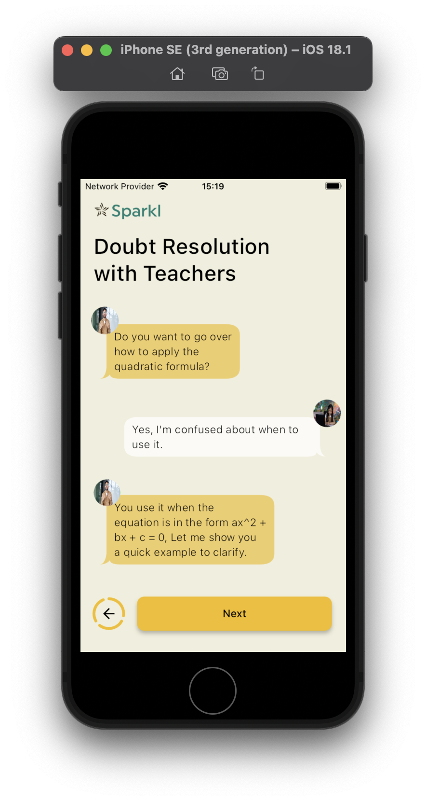

# 🚀 Sprkl Onboarding

## 🌟 Overview

Sparkl Onboarding is a Flutter project designed as part of an assessment. The project focuses on creating a smooth and engaging onboarding experience for users. It utilizes a variety of Flutter packages to enhance the user interface and functionality.

## Screenshots 📸

### iOS

||||

### Android

||||

---

## 🏗️ Architecture

The project follows the MVC (Model-View-Controller) architecture pattern, which helps in organizing the codebase and separating concerns. This makes the code more maintainable and scalable.

## 📂 File Structure

The project is structured as follows:

```
lib/
├── archive/                # 📦 Archive files
├── core/                   # 🧩 Core functionalities and configurations
│   ├── config/             # 🎨 App assets, themes, and colors
│   └── utils/              # 🛠️ Utility files (e.g., sizer for responsive design)
├── views/                  # 🖼️ UI components
│   ├── widgets/            # 🧩 Reusable widget files
│   └── view files          # 📄 View files for different screens
└── main.dart               # 🚪 Entry point of the application
```

## 📦 Packages Used

The project leverages several Flutter packages to enhance its functionality and user experience:

```
cupertino_icons: ^1.0.8 - Provides Cupertino icons for the app. 🍎

lottie: ^3.3.1 - Enables the use of Lottie animations. 🎬

video_player: ^2.9.3 - Allows playing videos within the app. 📹

dotted_border: ^2.1.0 - Adds dotted borders to widgets. 🟢

google_fonts: ^6.2.1 - Provides a wide range of Google Fonts. 🔤

provider: ^6.1.2 - State management solution for Flutter. 🧠

flutter_animate: ^4.5.2 - Adds animations to widgets easily. ✨

chat_bubbles: ^1.7.0 - Provides chat bubble widgets. 💬

permission_handler: ^11.4.0 - Handles runtime permissions. 🔒

camera: ^0.11.1 - Integrates camera functionality. 📸
```

## 🛠️ Getting Started

To get started with the project, follow these steps:

Clone the repository:

```bash
git clone https://github.com/yourusername/sparkl_onboarding.git
```

Navigate to the project directory:

```bash
cd sparkl_onboarding
```

Install dependencies:

```bash
flutter pub get
```

Run the app:

```bash
flutter run
```
